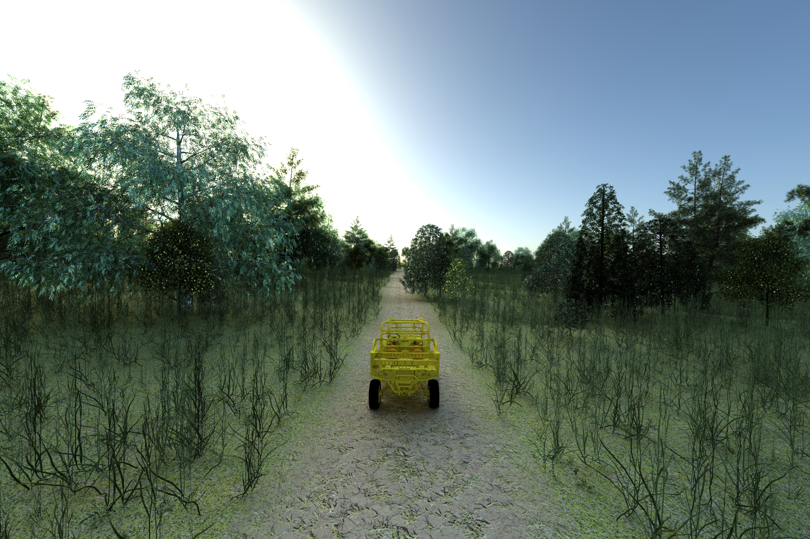
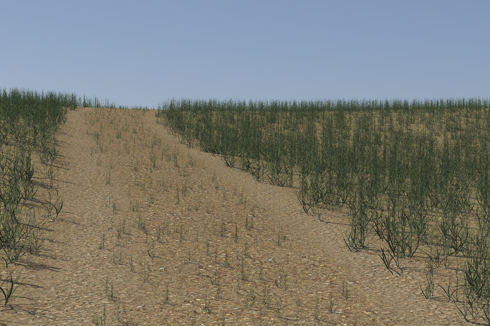
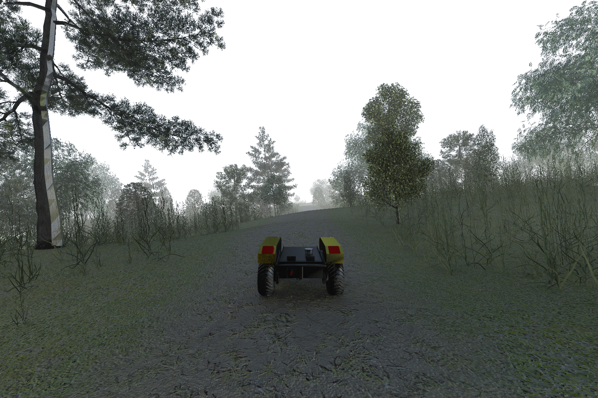
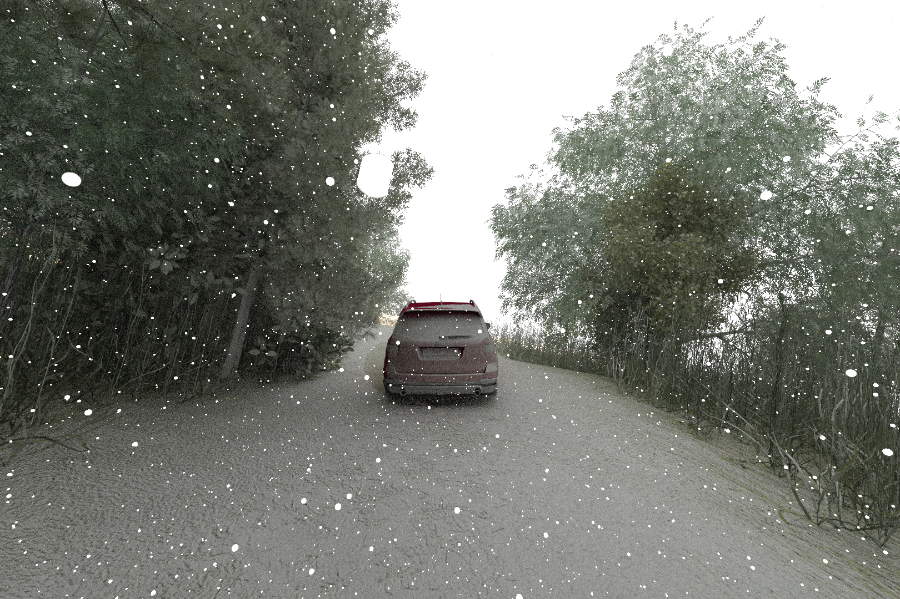

# The MSU Autonomous Vehicle Simulator

The MSU Autonomous Vehicle Simulator (MAVS) is

* A software library for simulating autonomous vehicles in realistic digital terrain.
* A real-time simulator for evaluating the performance of autonomous perception and navigation software.
* A physics-based sensor simulator for LIDAR, GPS, cameras, and other sensors.

Instructions for building, installing, and using MAVS can be found in the [documentation](https://cgoodin.github.io/msu-autonomous-vehicle-simulator/).

## License
MAVS is licensed under the [MIT License](https://github.com/CGoodin/msu-autonomous-vehicle-simulator?tab=MIT-1-ov-file#readme).

## Citing MAVS
If you use MAVS for your research, please cite one or more of the following publications.
* [Hudson, C., Goodin, C., Miller, Z., Wheeler, W., & Carruth, D. (2020, August). Mississippi state university autonomous vehicle simulation library. In Proceedings of the Ground Vehicle Systems Engineering and Technology Symposium (pp. 11-13).](http://gvsets.ndia-mich.org/documents/MS2/2020/MS2_1130_Mississippi%20State%20University%20Autonomous%20Vehicle%20Simulation%20Library_Paper.pdf)
* [Goodin, C., Carruth, D. W., Dabbiru, L., Hudson, C. H., Cagle, L. D., Scherrer, N., ... & Jayakumar, P. (2022, June). Simulation-based testing of autonomous ground vehicles. In Autonomous Systems: Sensors, Processing and Security for Ground, Air, Sea and Space Vehicles and Infrastructure 2022 (Vol. 12115, pp. 167-174). SPIE.](https://www.spiedigitallibrary.org/conference-proceedings-of-spie/12115/0000/Simulation-based-testing-of-autonomous-ground-vehicles/10.1117/12.2620502.short)
* [Carruth, D. W., Goodin, C., Dabbiru, L., Scherrer, N., Moore, M. N., Hudson, C. H., ... & Jayakumar, P. (2024). Comparing real and simulated performance for an off?road autonomous ground vehicle in obstacle avoidance. Journal of Field Robotics, 41(3), 798-810.](https://onlinelibrary.wiley.com/doi/pdf/10.1002/rob.22289?casa_token=AWIaWOHouPUAAAAA%3AxC5wIiRRir4cZYoIzuuhiIBSQEuYNSNfMR49nujwvTMz7Ggq1PuCO-W15-w7r8Zq6iIixz4RjR8VVk4)

## Gallery
MAVS can automatically generate random ecosystems complete with trails and realistic vegetation.

MAVS can also simulate environmental features like rain and dust and their influence on sensors.

